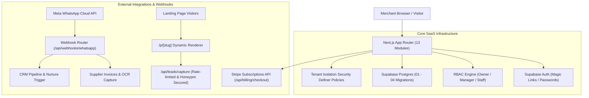

# 🚀 Miller SaaS Hub

> **Multi-Tenant E-Commerce Infrastructure & AI Agent Platform**  
> *Powered by Miller AI · 80% AI Agent Driven*

[](https://nextjs.org/)
[](https://react.dev/)
[](https://supabase.com/)
[](LICENSE)

---

## 🌟 Overview

**Miller SaaS Hub** is a multi-tenant commerce operating system enabling merchants to spin up storefronts, orchestrate multi-channel operations (Shopify, eBay, Amazon, UberEats, JustEat), capture and nurture inbound leads, automate competitor repricing, and process supplier invoices via WhatsApp OCR.

The platform provides **two operation modes**:
1. **Interactive Demo Sandbox (Offline Mode)**: Allows instant evaluation and client walkthroughs without external credentials.
2. **Production Multi-Tenant Mode**: Connects directly to Supabase Postgres with cryptographic Row-Level Security (RLS) tenant isolation and live API gateways (Stripe, Meta WhatsApp Cloud API, JigsawStack AI).

---

## 🧭 System Architecture



---

## 📦 Dashboard Modules (13 Interactive Hubs)

| Module | Route | Key Capabilities |
| :--- | :--- | :--- |
| **Analytics Console** | `/dashboard` | Revenue breakdown, order velocity, inventory health, AI alerts |
| **Product Catalog** | `/dashboard/products` | Multi-category inventory, variant pricing, barcode lookups |
| **Orders Logs** | `/dashboard/orders` | Multi-channel order fulfillment, status pipelines, tracking logs |
| **Competitor Repricing** | `/dashboard/competitor` | Dynamic price scraping, margin floor protection, automated adjustments |
| **Ad Intelligence** | `/dashboard/ads` | AI ad creative generation, ROAS tracking, campaign budgeting |
| **AI Product Scraper** | `/dashboard/scraper` | Live URL scraping into inventory items using Deno edge workers |
| **Integrations Panel** | `/dashboard/integrations` | Stripe, PayPal, Klarna, Open Banking (Banked/Tink), SendGrid |
| **Social Media Hub** | `/dashboard/social-setup` | Multi-platform publishing (Instagram, Facebook, TikTok, X, LinkedIn) |
| **Platform Connector** | `/dashboard/connect` | Synchronize Shopify, Amazon FBA, eBay, UberEats, JustEat feeds |
| **Social Accounts** | `/dashboard/social-accounts` | 5 Dedicated Miller AI Social Agents (Monitor, Post, Reply, Growth, Alert) |
| **Purchase Hub** | `/dashboard/purchases` | WhatsApp supplier invoice capture, receipt OCR parser, AP ledger |
| **Landing Builder** | `/dashboard/landing-builder` | 1-Click AI landing page generator with instant live hosting |
| **Lead CRM & Nurture** | `/dashboard/leads` | 6-Stage pipeline with automated Miller AI nurture message dispatch |
| **Billing & Plans** | `/dashboard/billing` | Starter (£29/mo), Growth (£79/mo), Agency (£199/mo) with live metering |
| **Auth & RBAC Portal** | `/login` | Multi-tenant auth with instant demo role switcher |

---

## 🛡️ Security Model & Tenant Isolation (RLS)

All database operations are guarded by Row-Level Security policies in `supabase/migrations/04_strict_security_and_tenancy.sql`:

- **Tenant Isolation**: Queries execute through security definer function `public.is_store_member(store_id, min_role)`.
- **Role Hierarchy**:
  - 👑 **`owner`**: Full administrative access (billing, settings, API integrations).
  - 💼 **`manager`**: Management access (CRM, landing pages, catalogs, competitor monitoring).
  - 🛡️ **`staff`**: Operational access (orders, purchases, WhatsApp inbox).
- **Public Endpoints**:
  - `/api/leads/capture`: Protected by IP sliding window rate limiting (10 req/min), honeypot bot trap detection, and mandatory store validation.
  - `/p/[slug]`: Restricted to published landing pages (`published = true`).

---

## 🛠️ Getting Started

### 1. Prerequisites
- Node.js 18+ or 20+
- npm, pnpm, or yarn

### 2. Installation
```bash
git clone https://github.com/Fernando280773/-miller-saas-hub.git
cd -miller-saas-hub
npm install
```

### 3. Environment Variables
Copy `.env` and configure your credentials:
```bash
# Supabase Configuration
NEXT_PUBLIC_SUPABASE_URL=https://your-project.supabase.co
NEXT_PUBLIC_SUPABASE_ANON_KEY=your-supabase-anon-key

# Stripe Payments
STRIPE_PUBLIC_KEY=pk_test_...
STRIPE_SECRET_KEY=sk_test_...

# AI & Scraper APIs
JIGSAWSTACK_KEY=your_jigsawstack_api_key
```

### 4. Database Setup (Supabase)
Execute migrations in your Supabase SQL editor in sequential order:
1. `supabase/migrations/01_init_schema.sql`
2. `supabase/migrations/02_phase1_database.sql`
3. `supabase/migrations/03_v2_schema.sql`
4. `supabase/migrations/04_strict_security_and_tenancy.sql`

### 5. Running the App
```bash
npm run dev
```
Open [http://localhost:3000](http://localhost:3000) in your browser.

---

## 🧪 Production Verification & Build
To verify type safety and generate optimized production bundles:
```bash
npm run build
```

---

## 📄 License
MIT License © 2026 Miller SaaS Hub. All rights reserved.
