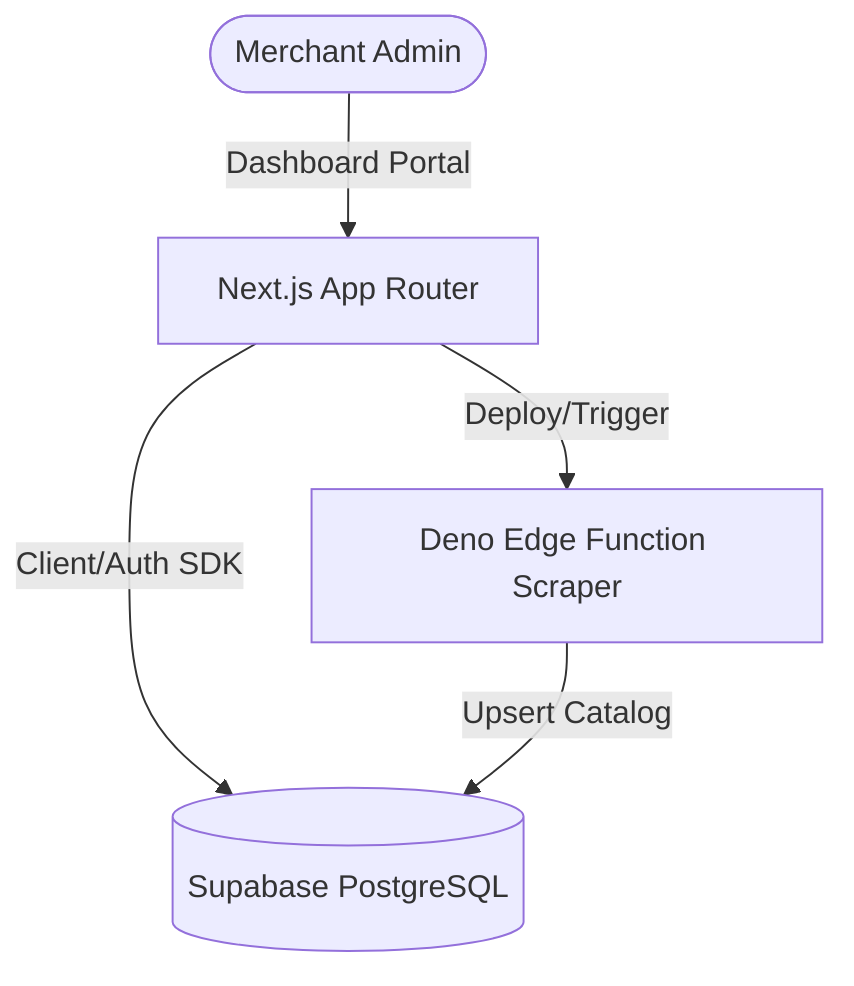

# Miller SaaS Hub Project Roadmap & Introduction

Welcome to **Miller SaaS Hub**, a next-generation multi-tenant e-commerce SaaS architecture built using **Next.js (App Router, TypeScript)** and a **Supabase** backend.

This document details the project layout, database schema designs, and Edge Functions roadmap.

---

## 🏗️ Architectural Topology

Our architecture is structured as follows:



---

## 📁 Directory Structure

```
e-commers-sass/
├── introduction.md          # Project roadmap (This file)
├── supabase/
│   ├── migrations/          # SQL scripts for database tables
│   └── functions/           # Scrapers & sync logic (Edge Functions)
├── src/
│   ├── components/          # React Components (IntegrationsList, Sidebar, etc.)
│   ├── lib/                 # Shared client initializers (Supabase Client)
│   └── app/                 # Next.js App Router dashboard pages
└── .env                     # Local environment keys (Stripe, Supabase, Scraper)
```

---

## 🗄️ Database Tables Schema

We use Supabase PostgreSQL to drive tenant management. The tables include:

1. **`stores`**: Registered merchant shops.
   - `id`: UUID (Primary Key)
   - `created_at`: Timestamp
   - `name`: Text
   - `subdomain`: Text (Unique index)
   - `logo_text`: Text (Emoji or branding initial)
   - `primary_color`: Text (Hex styling variables)
   - `description`: Text
2. **`products`**: Merchandising catalogs.
   - `id`: UUID (Primary Key)
   - `store_id`: UUID (Foreign Key to `stores` ON DELETE CASCADE)
   - `name`: Text
   - `price`: Numeric
   - `category`: Text
   - `description`: Text
   - `stock`: Integer (Inventory counts)
   - `image`: Text (Emoji or visual asset)
   - `image_url`: Text (Optional custom base64 canvas image)
3. **`orders`**: Customer transaction entries.
   - `id`: UUID (Primary Key)
   - `store_id`: UUID (Foreign Key to `stores` ON DELETE CASCADE)
   - `customer_name`: Text
   - `customer_email`: Text
   - `total`: Numeric
   - `status`: Text (Pending, Shipped, Delivered)
   - `shipping_address`: Text
4. **`integrations`**: Connected SaaS modules.
   - `id`: UUID (Primary Key)
   - `store_id`: UUID (Foreign Key to `stores` ON DELETE CASCADE)
   - `name`: Text (e.g. Stripe, SendGrid, Shopify Sync, Scraper)
   - `type`: Text
   - `status`: Text (Active, Inactive)
   - `config`: JSONB (API credentials, webhooks)
5. **`platform_accounts`**: Connected third-party seller platform accounts (eBay, Amazon, food delivery, etc.).
   - `id`: UUID (Primary Key)
   - `store_id`: UUID (Foreign Key to `stores` ON DELETE CASCADE)
   - `platform_name`: Text (e.g., 'ebay', 'amazon', 'uber_eats')
   - `account_name`: Text (Seller account alias)
   - `status`: Text (Active, Inactive)
   - `credentials`: JSONB (OAuth credentials, region config, APIs)
6. **`trade_orders`**: Synced external orders from third-party platform channels.
   - `id`: UUID (Primary Key)
   - `store_id`: UUID (Foreign Key to `stores` ON DELETE CASCADE)
   - `platform_account_id`: UUID (Foreign Key to `platform_accounts` ON DELETE SET NULL)
   - `external_order_id`: Text (Order ID generated by the third-party platform)
   - `customer_name`: Text
   - `customer_email`: Text
   - `total_amount`: Numeric
   - `order_status`: Text (e.g., Pending, Shipped, Cancelled)
   - `channel`: Text (e.g. ebay, amazon, uber_eats)
   - `items`: JSONB (List of products, quantities, prices purchased)
7. **`competitor_pricing`**: Synced pricing of direct competitors on external platforms.
   - `id`: UUID (Primary Key)
   - `product_id`: UUID (Foreign Key to `products` ON DELETE CASCADE)
   - `competitor_name`: Text (e.g., Amazon, competitor store name)
   - `competitor_url`: Text (Web URL link to competitor product listing)
   - `price`: Numeric (Competitor listed price)
   - `is_active`: Boolean (Whether active or deprecated)


---

## ⚡ Edge Functions Scrapers

The custom scraping backend is built in Deno TypeScript and resides in `supabase/functions/product-scraper/`:
- **Simulates Scraping Catalogs**: Accepts target JSON or CSV feeds and parses products.
- **Inventory Synchronization**: Writes or updates items directly into the Supabase `products` table for a specific store.
